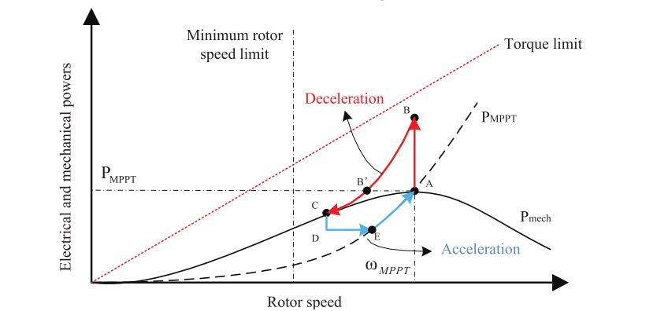

### How freuquency changes in electric grid? ###
One of the most important requirement of an electric grid is the constant frequency. Grid operators has to maintain grid frequency between predetermined values. Frequency in a electric grid depends on the balance between generation and the demand and changes according to the swing equation.  

  

According to the swing equation, frequency in a grid decreases if the generated power is less than the consumed power. This occurs with either load connection or generally with sudden generator outage. As soon as this power inequality is experienced in the grid, frequency starts to deviate from the nominal value. The difference power is supplied from the kinetic energy stored in the turbine inertia. 

  

As seen from the Figure above, the frequency falls rapidly due to an event occuring in the point O. Here, rate of change of frequency depends on basically the total inertia of the grid. The lower inertia the grid has, the steepest falls the frequency. However, the frequency nadir is dependent on the grid inertia and also the governor action of the conventional synchronous generators. The fall in the frequency is arrested with both inertia of the grid and the governor action. As soon as the governor action is completed, the grid frequency is stabilized. However, the frequency would be still far away from the nominal value. In order to frequency restore, the secondary controllers should act and push frequency to higher values by producing more power than the consumed power.  

Inertial support has huge importance on frequency stability.Rate of change of frequency is determined by the synchronous generator inertial support. This is achieved by the "inherently" by synchronous generators due to the fact that they rotate with synchronous speed and this speed is grid frequency dependent. As the grid frequency decreases, the synchronous speed also decreases which will slow down the generator resulting with the extraction of the kinetic energy.  

### Reasons of the decrease in grid inertia ###
Most of the renewable energy sources are connected to grid via power electronics. Type 1 and Type 2 wind turbines are connected directly to the grid. Therefore, the grid frequency deviations will affect the power generation of these turbines. In other words, the generated power will be affected by the grid frequency deviation. Nonetheless, the Type 3 and Type 4 turbines are connected to grid with partial scale and full scale power electronics respectively. Power electronics gives freedom to user for many different applications like active and reactive power control. For example, variable speed wind turbines are able to operate in a wide speed range independent of grid frequency. This allows the wind turbine to operate in maximum power point. However, existing power electronics systems are not affected to frequency disturbances. As a result of this, their inertia is not reflected to grid. Hence, the equivalent grid inertia is getting lower with the penetration of renewable energy sources. Another reason for the decrease in the grid inertia is the **de-commitment** or **dispatch** of the conventional sources due to economical concerns(renewable sources are preferred instead of conventional generators) [ref]  

### Control Diagram of the Permanent-Magnet Synchronous Generator Wind Turbines ###

The main control diagram of the PMSG wind turbine is given below. In the figure, the aerodynamic model represents the wind turbine structure which captures power from the air. This power depends on the wind speed, pitch angle and the rotational speed. Therefore, the operator should manage speed and the pitch angle so that the operation is in the most efficient point. 
 
Permanent magnet coupled to wind turbine shaft is connected to grid with the Back-to-Back(BTB) Converter structure. This structure gives operator freedom. Therefore, by making use of BTB converter, the operator can define active and reactive power set points. BTB converter is composed of two different structure. The first one is the generator or machine side controller (MSC) which is connected to machine side. The other one is connected to grid side and hence it is callded grid side converter (GSC).  

The responsibilities are shared between these converters. MSC is responsible for speed reference and the active power reference meanwhile the GSC is responsible for the reactive power reference (also the power factor) and the DC voltage reference. As seen the figure below, the generator speed is dictated by controlling the q-axis current. This generator speed should be the maximum power point which is generally taken from look up table. 

  

GSC diagram is given in the figure below. As seen from diagram, DC link voltage is regulate by controlling the d-axis current. The q-axis current is set to zero in order to obtain unity power factor in the point of common coupling (PCC). 

  

### Frequency Regulation Mechanisms ###
With the increasing penetration of the renewable sources, system operators started to include frequency regulating mechanism from the renewable sources. One of the first regulation that include WTs in frequency regulating mechanism states that WT should regulate active power with respect to the grid frequency. Even though it does not require inertial support, the regulation states that WT should curtain its active power for high frequencies [Nordic-ref]. Thereafter, Hydro Quebec utility required inertial support from the wind farm whose power is more than 100 MW. The support should be equivalent to the synchronous generator with inertia constant 3.5 seconds. The additional power should be at least 5% and it should last for 10 seconds. 

### Inertia Support Methods in the Literature ###

The inertia support from a wind turbine should be supplied from some energy stored in the wind turbine due to the fact that the amount of energy captured from the wind is constant for momentarily. Therefore, the WT should make use of either the stored kinetic energy in the turbine inertia (blades, gearbox and generator inertia) or the stored electrostatic energy in the DC link capacitor. 

There are two main methods in the literature. Both method modifies the torque set point of the generator so that the whole system slows down and extracts the kinetic energy stored in the total inertia of the wind turbine.  

#### Torque limit based inertia support ####
In this type of inertial control the system slows down with the limit torque. The limit torque is carefully selected for the secure operation. Torque limit is generally selected as 1.2 pu. The slow down operation is maintained until the pre defined minimum speed. Inertial support is activated when the frequency excursion exceeds the dead-band.  
  

#### Frequency based inertial control ####

In this type of control, the torque set point of the turbine is adjusted based on the rate of change of the frequency. Additional power can also be extracted from the DC link capacitor. If the voltage set point of the DC link is also adjusted depending on the frequency deviation. However, it should be noted that the stored electrostatic energy is much lower than the kinetic energy stored in the turbine inertia. 

  

