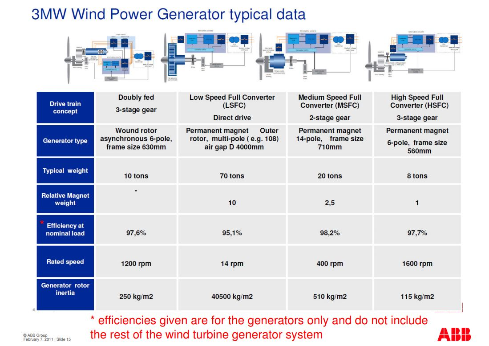

**BARES Wind Turbine Properties**  

BARES is an Wind Farm located in Balıkesir with 52 Wind Turbines of 142.5 MW. Each turbine has a power rating of 2.75 MW (GE 2.75-103)

**Turbine Properties**  
Power Rating: 2.75 MW 
Rotor Diameter: 103m  
Gearbox Ratio: 1:117.4 (Winergy)
Generator Rated Speed: 550-1735 rpm  
Rotor Rated Speed: 4.7-14.8 rpm  
Generator: PM Synchronous (Winergy)  
Generator Voltage: 690V  

There is no given inertia value for generator or blade. For now, following inertia values will be used. 

Generator Inertia: 240 kgm2  
Blade Inertia: 12.6*10^6kgm2  
Generator Pole: 4  

Source:  
http://www.iaeng.org/publication/IMECS2010/IMECS2010_pp930-933.pdf 

Another Source:

